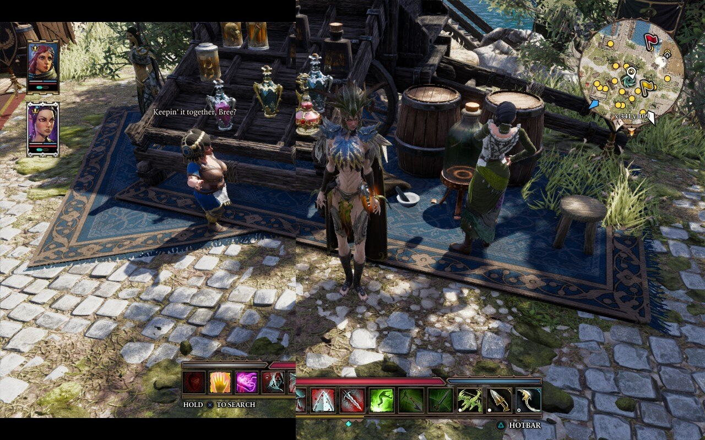

# Divinity: Original Sin 2 16:10 patch for Steam Deck

This patch removes letterboxing (black bars) on Steam Deck native resolution without stretching.

Supported game version: 3.6.117.3735 (latest as of 1/6/2024) Steam/GOG, verified on SteamOS 3.5.19.

**Installation:**
- [Download](https://github.com/psykana/dos2deck/releases/latest) latest release
- [Transfer](https://www.youtube.com/watch?v=VfsSCMiZVf4) d3d11.dll to `.../Divinity Original Sin 2/DefEd/bin`
- Launch the game, set resolution to 1280x800

**Known issues:**
Short profile name may cause "(Y) Change Profile" text in the main menu to get a little bit off screen.
Since GUI files are the *only* ones that cannot be easily overriden by mods, I decided to leave it be.

Reach out on [Larian Studios discord](https://discord.com/invite/larianstudios) server.

**Credits:**
* [Larian Studios](http://larian.com/), for [Divinity: Original Sin 2](http://store.steampowered.com/app/435150/Divinity_Original_Sin_2/)
* [Valve](https://www.valvesoftware.com/en/) for Steam Deck and Proton
* Norbyte, Pip and others at `#dos-modding` for info on game's engine inner workings.